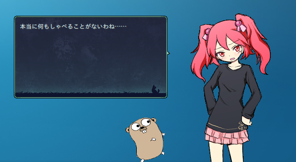

Gohst
===

Sample Ghost for Ukagaka written in Go with the power of cgo, for my blog post "[Goを使ってDLLをクロスコンパイル on Linux](http://kurousada.ga/posts/cross-compile-dll-using-golang-on-linux/)", a part of [Go Advent Calender 2017（その4）](https://qiita.com/advent-calendar/2017/go4).



[Go Advent Calender 2017（その4）](https://qiita.com/advent-calendar/2017/go4)の一日目の記事である「[Goを使ってDLLをクロスコンパイル on Linux](http://kurousada.ga/posts/cross-compile-dll-using-golang-on-linux/)」のサンプルゴーストです。

「[伺か](https://ja.wikipedia.org/wiki/伺か)」というデスクトップアプリケーションに使われるキャラクターの、脳に当たる部分である「[栞]()」をGoで書きました。
記事で説明したものを基に、ランダムトークしてくれるように書き足しています。

## 機能

 - かわいい女の子 ~~のソロゴースト~~ とGopherくんです。
 - [奈良阪某](https://narazaka.net/)さんの[github.com/Narazaka/shiorigo](https://github.com/Narazaka/shiorigo)を使っています。
 - だいたい15〜30秒に一回ぐらいの頻度でランダムトークします。ネタが少ないのは仕様です。
 - 起動時と終了時にも話します。
 - その他の機能はありません。つついても撫でても無反応です。~~お触りし放題！~~
 - ベースウェアとの通信ログがベースウェアのゴーストフォルダ内`gohst/ghost/master/shiori.log`に残ります。
 - 通信はリクエスト・レスポンスともにUTF-8決め打ちですが、ログはShift_JISです。
 - シェルは[ボトル猫](http://catbottle.sakura.ne.jp/)さん作成の超かわいいフリーシェル『[pink](http://wikiwiki.jp/feeshell/?cmd=read&page=pink)』を使っています。

## Installation

[Releases](https://github.com/kurousada/gohst/releases)からnarファイルをダウンロードできますので、お好みのベースウェアを起動してドラッグ&ドロップしてください。

Wine 上の SSP だとなぜか 2回インストールしようとして「上書きしないで別のフォルダ作る？」的なことを聞かれるので「いや、上書き」とお答えください。

動作確認は以下の環境で行っています。

 - [SSP](http://ssp.shillest.net/) 2.4.13 with Wine 1.6.2 (64bit) on Linux Mint 18.2 Sonya Xfce (64bit)

## Compilation

コンパイルには以下のものが必要です。

 - Go 1.9.2（たぶん他のバージョンでもWindowsでの`-buildmode=c-archieve`をサポートしていればコンパイルできます）
 - GCC 5.3.1（たぶん他のバージョンでもコンパイルできます）
 - [github.com/Narazaka/shiorigo](https://github.com/Narazaka/shiorigo)

Linux/MacでもMinGWを用意すればコンパイルできます。
詳しくは「[Goを使ってDLLをクロスコンパイル on Linux](http://kurousada.ga/posts/cross-compile-dll-using-golang-on-linux/)」を見てください。

### レポジトリをクローン

```sh
$ git clone 'https://github.com/kurousada/gohst'
$ cd gohst
```

### 必要なパッケージをインストール

```sh
$ go get github.com/Narazaki/shiorigo
```

### shiori.dllのコンパイル

```sh
$ CGO_ENABLED=1 GOOS="windows" GOARCH="386" CC="gcc" go build -buildmode=c-archive -o libshiori.a
$ gcc -m32 -shared -o shiori.dll shiori.def libshiori.a -Wl,--allow-multiple-definition -static -lstdc++ -lwinmm -lntdll -lws2_32
```

MinGWのGCCを使う場合はGCCのコマンドや引数、環境変数`CC`を適切なものにしてください。

### narファイル作成

コンパイルしてできた`shiori.dll`を`gohst/ghost/master/`にコピーし、`gohst`フォルダをZIP圧縮します。
そして拡張子を`.nar`にすれば完成です。

```sh
$ cp shiori.dll gohst/ghost/master/shiori.dll
$ zip -r -q -l gohst.zip gohst                  # -l オプションでLFをCR+LFに変換します。
$ mv gohst.zip gohst.nar                        # narファイルはzipファイルの拡張子を変えただけです。
```

### 非Windows環境向けシェルスクリプト

コンパイル〜nar作成までしてくれるシェルスクリプトを用意してあります。
MinGWとGo、zipコマンドがインストールされていればこちらが便利です。

```sh
$ chmod +x ./compile.sh  # 実行権限を付与
$ ./compile.sh
```

Makefile……？なにそれおいし(ry

## TODO

 - テストを書く（`go test`とテスト用のベースウェアエミュレータで書ける？）
 - ゴーストのトークや反応、機能を増やす
 - ~~相方を見つける（ソロだと基本的に独り言かユーザーさんに話しかける必要があるので……）~~ *Gopherくんが相方です！*

## License

シェル部分（`descript.txt`と`surfaces.txt`を除く）は[ボトル猫](http://catbottle.sakura.ne.jp/)さんの著作物です。
また、[Gopher](https://blog.golang.org/gopher)は[Renee French](http://reneefrench.blogspot.com/)さんによってデザインされました。

そのほかの[Kuro Usada](http://kurousada.ga/)が作った部分はMIT Licenseにしておきます。
